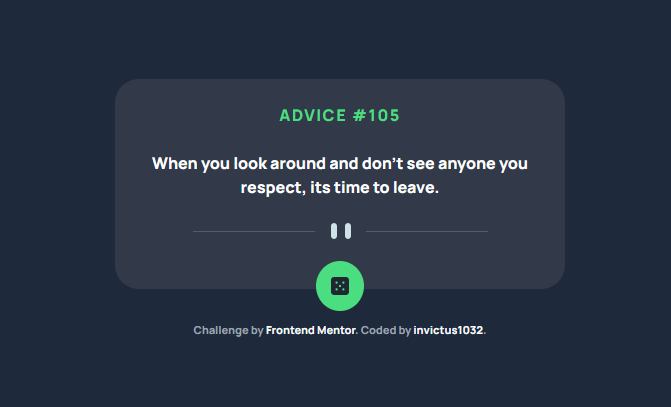
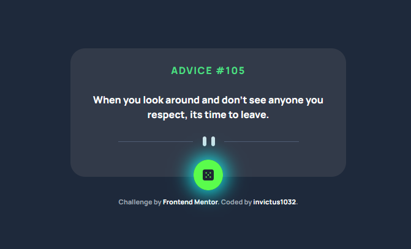
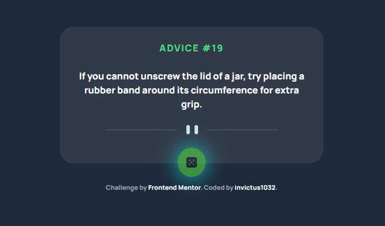
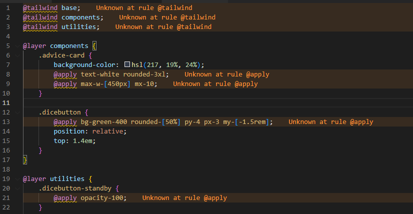
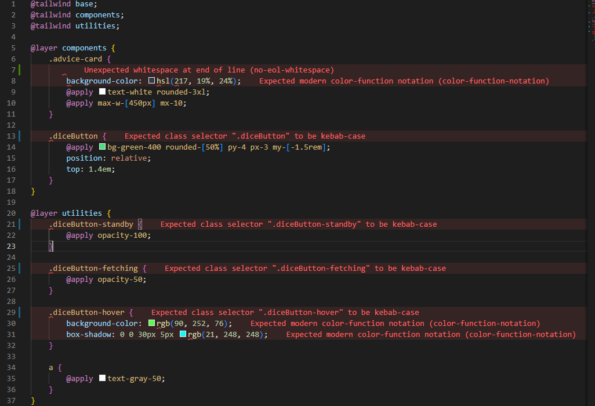

# Frontend Mentor - Advice generator app solution

This is a solution to the [Advice generator app challenge on Frontend Mentor](https://www.frontendmentor.io/challenges/advice-generator-app-QdUG-13db). Frontend Mentor challenges help you improve your coding skills by building realistic projects.

## Table of contents

- [Overview](#overview)
  - [The challenge](#the-challenge)
  - [Screenshot](#screenshot)
  - [Links](#links)
- [My process](#my-process)
  - [Built with](#built-with)
  - [What I learned](#what-i-learned)
  - [Continued development](#continued-development)
- [Author](#author)

## Overview

### The challenge

Users should be able to:

- View the optimal layout for the app depending on their device's screen size
- See hover states for all interactive elements on the page
- Generate a new piece of advice by clicking the dice icon

### Screenshot

#### Initial State



#### Hover State



#### Active State



### Links

- Solution URL: [Frontend Mentor](https://www.frontendmentor.io/solutions/advice-generator-app-with-tailwind-typescript-r4OB5cn6_M)
- Live Site URL: [Netlify](https://fem-invictus1032-3.netlify.app/)

## My process

### Built with

- Semantic HTML5 markup
- [Tailwind CSS](https://tailwindcss.com/)
  - Flexbox
  - Mobile-first workflow
- [TypeScript](https://www.typescriptlang.org/)
- [Stylelint](https://stylelint.io/)

### What I learned

I learned many new technologies with this project

1. TypeScript

    I've never used TypeScript before, I just heard we should use it, so I figured I'll just learn it while building a project. Guess what, it's one of the best decision I've ever made. No joke, I have no idea why I never used TypeScript before, this thing is such a life saver. The strict type checking caught a lot of bugs for me.

2. Fetch

    asynchronous code has always been my biggest enemy. I spent hours trying to figure out how to extract a fetch respone from the advice API. Turned out it's actually very simple:
    ```js
    async function getAdvice() {
      const res = await fetch("https://api.adviceslip.com/advice");
      const { slip } = await res.json();
      return slip;
    }
    ```
    bruh

3. Stylelint

    I've been using tailwindcss for a while, and there's always this annoying "unknown at rules".
    
    I had searched all over the internet and most solutions out there suggest disabling VS Code CSS validation. I don't think that's a solution because would disable the whole validation, not just unknown at rule. 
    
    Finally, I found [this issue](https://github.com/tailwindlabs/discuss/issues/111) on Github and there was someone mentioning about Stylelint. I thought it's tailwindcss config, turned out it's an entirely independent CSS validator. I disabled VS Code built-in CSS validator and gave Styleint a try... and damn ... another tool I had no idea why I never used it before. So, I was just going to use it its flexibility to ignore certain unknown at rules errors, but ended up using most of its linter benefits, like enforcing letter casing. 

    

### Continued development

No doubt, I will start using TypeScript and Stylelint from now on, even if it's just a small project, as it helped me reinforce my skills. 

## Author

- [@invictus1032](https://www.frontendmentor.io/profile/invictus1032)
